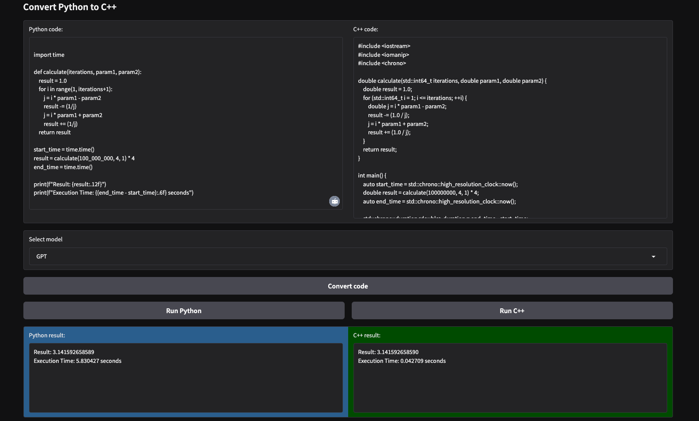

# Code Converter



## Introduction

The **Python-to-C++ code converter** is a system designed to leverage **Large Language Models (LLMs)**, specifically **OpenAI GPT** and **Anthropic Claude**, to transform Python code into high-performance C++ code. The goal of the system is to produce C++ implementations that are functionally equivalent to the input Python code while achieving maximum execution efficiency, particularly on Apple M1 processors. This approach ensures faster execution times and efficient resource utilization by capitalizing on C++'s performance capabilities.

## Implementation Details

The implementation begins with **prompt engineering**, where detailed system and user prompts are constructed to guide the **LLMs** in generating high-quality **C++ code**. The **system message** specifies that the assistant should produce **C++ code** with minimal comments and a strong focus on execution speed. The **user prompt** includes the **Python code** to be converted and provides additional instructions to optimize the resulting **C++ implementation** while preventing issues such as **integer overflows**.

The system handles code input and output effectively. Python code provided by the user is processed into a structured prompt for the LLMs. The resulting C++ code is then formatted and stored locally for further execution or refinement. Model interactions are streamlined using token-by-token streaming to provide real-time feedback during the code conversion process.

Python code execution is handled within a sandboxed environment using the exec function, with its output captured via **io.StringIO**. For **C++ code**, the system compiles the generated code using the **Clang compiler** with aggressive optimization flags such as -Ofast, ensuring the highest possible performance. The compiled binary is executed, and its output is captured for comparison with the Python results.

## User Interface

The user interface is built using **Gradio**, offering a seamless and interactive experience. Users can input Python code and view the generated C++ code in dedicated textboxes. A dropdown menu allows the selection of either **GPT** or **Claude** for code conversion. Buttons enable users to execute the Python and C++ code, with results displayed in separate text areas for easy comparison. This interface is intuitive and designed to make the code conversion and execution process straightforward, even for users unfamiliar with C++.

## Features

The system is built with a strong emphasis on **speed optimization****. The C++ code generated by the LLMs incorporates architecture-specific enhancements and is compiled with aggressive optimization settings. **Real-time feedback** during the **code conversion** and execution process is facilitated through **streaming outputs**, providing users with immediate visibility into the system's operations. Robust **error handling mechanisms** are in place to capture and display issues such as compilation failures or runtime errors in the generated C++ code.

## Usage

Clone this repo (https://github.com/JoKerDii/code-converter.git):

```bash
git clone https://github.com/JoKerDii/code-converter.git
cd code-converter
```

Create a virtual environment:
```
python -m venv llm_venv
```

Activate the virtual environment:
```bash
source llm_venv/bin/activate
```

Download necessary dependencies.
```bash
pip install -r requirements.txt
```

Create `.env` file and add OpenAI API Key / Claude API Key.

Run the application locally:

```bash
python3 app.py
```